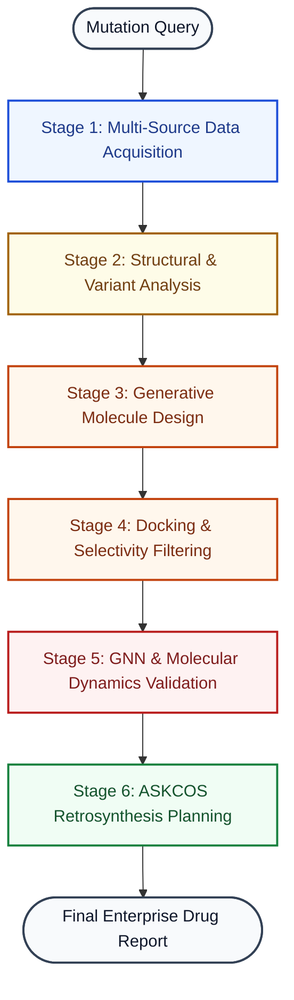

# ProEngine Labs

> **Precision Medicine & ProEngine Labs Pipeline**
> A 22-agent AI orchestrator for novel lead discovery, synthesis planning, and clinical validation.

[](https://opensource.org/licenses/Apache-2.0)
[](https://www.python.org/)
[](https://nextjs.org/)

---

## Overview

**ProEngine Labs** is an enterprise-grade drug discovery pipeline designed to identify, optimize, and validate therapeutic candidates for specific protein mutations (e.g., `EGFR T790M`). 

The system leverages a hierarchical 22-agent architecture to move from mutation parsing to synthesis-ready lead compounds in as little as 90 seconds (standard) to 6 hours (with full Molecular Dynamics validation).

### System Architecture



### Key Metrics & Precision
- **Affinity Scoring**: Multi-method validation using Vina, Gnina CNN, DimeNet++ GNN, and MM-GBSA.
- **Confidence Tiers**: Grounded in pLDDT and ESM-1v scores (WELL_KNOWN, PARTIAL, NOVEL).
- **Stability Labels**: Ranked by RMSD trajectories from 50ns MD simulations.
- **Selectivity**: Dual-docking against 10+ off-target proteins to ensure therapeutic windows.

---

## Technical Differentiation

### Intelligent Lead Filtration (The Funnel)
The pipeline employs a sophisticated filtration funnel to optimize computational resources while maintaining maximum empirical rigor:
1.  **Scaffold Hopping**: Generates ~150 candidates using RDKit-driven bioisostere replacements and 3D diffusion.
2.  **GNN Pre-Selection**: Utilizes a **DimeNet++ GNN** to filter the top 30 leads down to exactly **two high-confidence finalists**.
3.  **Molecular Dynamics**: Performs 50ns **OpenMM simulations** on finalists only, calculating precise MM-GBSA binding free energies (ΔG) and RMSD stability.

### Selectivity & Toxicity Benchmarking
ProEngine Labs dual-docks top leads against a panel of 10+ off-target proteins. This computes a **Selectivity Ratio** (Target Affinity / Off-target Affinity), identifying potential side-effects and ensuring a wide therapeutic window early in the discovery phase.

### Retrosynthetic Feasibility
Every discovered lead is validated through **ASKCOS** retrosynthesis planning. Candidates are scored by **Synthetic Accessibility (SA)** and mapped to specific reagents and steps, ensuring that the top leads are practical for experimental synthesis.

---

## The 22-Agent Architecture

The pipeline is organized into 10 specialized stages, each managed by autonomous agents.

| Stage | Mission | Agents |
|:---:|---|---|
| **1** | **Data Acquisition** | MutationParser, Planner, FetchAgents |
| **2-3**| **Structure & Variant** | StructurePrep (ESMFold), VariantEffect (ESM-1v), PocketDetection |
| **4-5**| **Design & Docking** | MoleculeGen (Pocket2Mol), Docking (Gnina/Vina), Selectivity, ADMET |
| **6-7**| **Ranking & Validation**| GNNAffinity (DimeNet++), MDValidation (OpenMM), Resistance Forecasting |
| **8-9**| **Context Analysis** | SimilaritySearch, SynergyAgent, ClinicalTrialAgent |
| **10** | **Output Generation** | SynthesisAgent (ASKCOS), ReportAgent |

---

## Quick Start (Enterprise Setup)

The project includes a comprehensive automation script that handles system-level dependencies including Miniconda, Python 3.11, AutoDock Vina, and Node.js.

### 1. One-Command Setup & Launch
```bash
./start.sh
```
*This script automatically detects missing dependencies, installs Miniconda if needed, creates the environment, and launches both frontend and backend.*

### 2. Manual Prerequisites
- **OS**: Linux (preferred) or macOS.
- **Conda**: Miniconda3 recommended.
- **Node.js**: v20 or later.
- **Bio-Tools**: AutoDock Vina, fpocket, Open Babel (automated via setup script).

---

## Project Architecture

```text
proengine/
├── backend/            # FastAPI + LangGraph Orchestrator
│   ├── agents/         # 22 Pipeline Agents
│   ├── pipeline/       # LangGraph state machine
│   ├── tests/          # Stress & Validation suites
│   └── data/           # Cache & Structure storage
├── frontend/           # Next.js 16 + Tailwind v4 + GSAP
│   ├── app/            # Feature-first routing
│   ├── components/     # Analysis, 3D Mol, & GNN Visuals
│   └── lib/            # SSE streaming & API hooks
├── tools/              # (Auto-generated) Local Miniconda & Binaries
└── docs/               # Technical specifications & Architecture
```

---

## Environment Configuration

### Backend (backend/.env)
| Variable | Required | Purpose |
|----------|----------|---------|
| `OPENAI_API_KEY` | Yes | Primary reasoning (GPT-4o) |
| `GROQ_API_KEY` | Recommended | Fast Llama 3.3 orchestration |
| `DATABASE_URL` | Optional | Persistent discovery library (Neon/Postgres) |

---

## Enterprise Standards

- **Observability**: Fully integrated with **LangSmith** for real-time agent tracing and audit logs.
- **Predictive Reliability**: All scores include uncertainty ranges (e.g., `-9.1 ± 1.2 kcal/mol`).
- **Safety Protocols**: No clinical claims. Predictive outputs only. Mandatory disclaimers on all reports.
- **Scalability**: Async SSE streaming for real-time pipeline progress updates.

---

## License

Apache License 2.0 — **Computational Predictions Only.** Experimental synthesis and binding validation required before biological testing.

**Notice: Not for clinical use.**